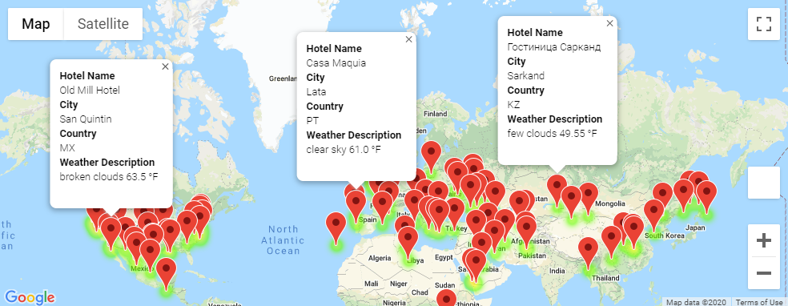

# World Weather Analysis

## Purpose
The purpose of this analysis was to update the current PlanMyTripp app based on beta testers feedback. The recommendations were to add the weather description to the weather data and include input statements to filter the data for weather preferences. From the list of potential travel destinations, the beta tester will choose four cities to create a travel itinerary. Lastly, using the Google Maps Directions API, a travel route will be created between the four cities as well as a marker layer map.

## Results

### Weather_Database
Numpy random module was used to generate latitude and longitude locations. With the these locations, citypy was used to find the neareast city from these coordinates. The output data from these locations include "City", "Country", "Lat","Lng", "Max Temp", "Humidity","Cloudiness","Wind Speed","Current Description" and are saved in "WeatherPy_Database.csv"

### Vacation_Search
The "WeatherPy_Database.csv" is imported and filtered based on the user's minimum and maximum temperature for the trip. In this example, the minimum temperature of 45 and maximum temperature of 65 were chosen. After the data frame was filtered, parameters were set to search for hotels within 5000 meters of the location using Google Maps Api. The hotel data was added onto the Data Frame and any rows with no hotels found were cleaned and removed from analysis. An output data was generated from this analysis and saved in "WeatherPy_vacation.csv". Below is an example of the analysis:

